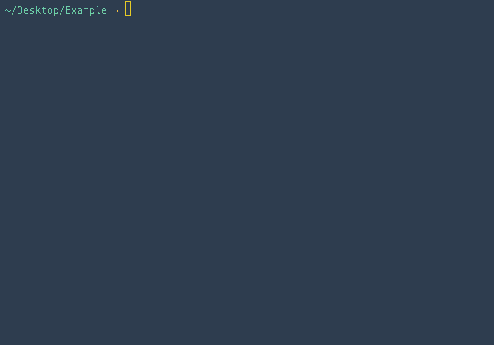

# Admin management

## Account management


Decoy ships with an interface for the management of admin user accounts.  In addition, admins can be created through the console by running `php artisan decoy:admin`.



## Permissions

Deeper roles and user permissions are configured in Decoy's `site.php` config file.  Here is an example using both roles and permissions.

```php?start_inline=1
'roles' => array(
  'general' => '<b>General</b> - Can manage sub pages of services and buildings (except for forms)',
  'forms' => '<b>Forms</b> - Can do everything a general admin can but can also manage forms.',
  'super' => '<b>Super Admin</b> - Can manage everything.',
),

'permissions' => [
  'general' => [
    'cant' => [
      'create.categories',
      'destroy.categories',
      'manage.slides',
      'manage.sub-categories',
      'manage.forms',
    ],
  ],
  'forms' => [
    'can' => [
      'read.forms',
      'update.forms',
      'manage.articles',
    ],
    'cant' => [
      'publish.articles'
    ],
  ],
  'forms' => [ // Demonstrating using a closure
    'can' => function() {
      return ['manage.forms'];
    },
  ]
],
```

Using roles and permissions causes additional options to appear in the admin:


The roles array generates the list of roles on the Admin edit screen. The permissions array defines what a user can and can't do. `Can` acts as a whitelist, `cant` as a blacklist and is dealt with second so it can override `can`.   The full list of supported actions that can be denied are:

- create
- read
- update
- destroy
- publish (set the `visibility`)
- manage (combines all of the above)

In addition, you can make custom permissions and check for them using the same methods.  For instance, you could add an `approve.articles` permission to the config and then check for it using `app('decoy.user')->can('approve', 'articles')`.  This is preferred over checking the admin's role as it is more flexible and expressive.

## Tracking changes

Decoy automatically tracks all admin changes and presents them in a view called "Changes".


