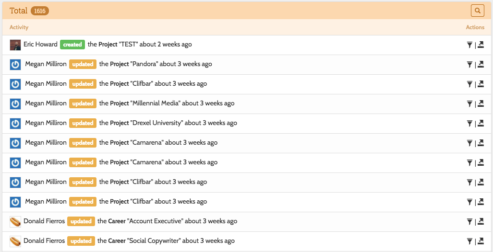

# Tracking changes

Within the Settings tab is the Changes page:

It lists all the changes that were made to models.  You can quickly view the changes made to a specific model by clicking the "History" button in the footer of an edit view:

The "open" icon shows you the changed attributes:

## Preview old versions

Click the bookmark icon to view a model on your public site at the time of a change.  This works by appending the id of the Change record to the public URL of your model.  That URL is determined by the `getUriAttribute()` method that is required to be defined on your model for this functionality to work.  

Additionally, it is recommended that you use this feature in conjunction with soft deleted models.  Otherwise, once a model is deleted, it won't be available for previewing.
