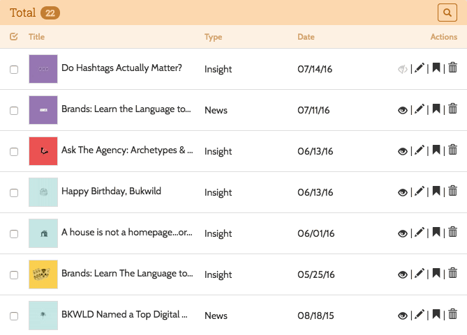

# Controllers

A lot of Decoy's "magic" comes by having your admin controllers extend the `Bkwld\Decoy\Controllers\Base`.  The title, description, listing columns, and many other things can be adjusted through the defintion of protected properties in the controller class.  To more dramatically affect behavior, you can also override the [CRUD](https://en.wikipedia.org/wiki/Create,_read,_update_and_delete) action methods of the base controller.  These approaches are described below.  

## Configurable properties

The following protected properties allow you to customize how Decoy works from the parent controller without overriding whole restful methods.  They generally affect the behavior of multiple methods.  They are all named with all-caps to indicate their significance and to differentiate them from other properties you might set in your admin controller.

* `title` - The title used for the pages generated by the controller. If left undefined, it's generated in the constructor from the controller class name.

* `description` - An optional sentenance or two that is displayed with the title in the header of the page.

* `columns` - An array of key value pairs used to describe what table columns to have in the listing view.  The default is: `['Title' => 'getAdminTitleHtmlAttribute']`.  The key is the label of the column, shown in the header of the table.  The value is the source for the data for the column.  Decoy first checks if there is a method defined on the model with the value and, if so, executes it to return the value.  If there is no method, it checks to see if the model has a property (or dynamic property) with that name and uses it's value of it does.  Finally, if none of those cases are true, it will use the value literally, rendering it in every row of the table.

* `search` - A multidimensional associative array that tells Decoy what fields to make available to the search on index views.  The syntax of this array is described later in the guide

* `show_view` - The path, in the Laravel format, to the view for the new/edit view.  I.e. 'admin.news.show'.

* `model` - The name of the controller associated with the controller.  For instance, "Client" in the examples above.  If left undefined, it's generated in the constructor based on the singular form of the controller name.  In addition, the constructor defines a class_alias of `Model` that you can use to refer to the model.  For instance, in a "Clients" controller, you could write `Model::find(2)` instead of `Client::find(2)`.

* `with_trashed` - Show soft deleted models in the listing.

* `controller` - The "path", in Laravel terms, of the controller (i.e. "admin.clients").  If left undefined, it's generated in the constructor from the controller class name.

The following properties are only relevant if a controller is a parent or child of another, as in `hasMany()`, `belongsToMany()`, etc.  You can typically use Decoy's default values for these (which are deduced from the `nav` Config property).

* `parent_model` - The model used by the parent controller (i.e. "Project").

* `parent_controller` - The parent controller (i.e. "admin.projects").

* `parent_to_self` - The name of the relationship on the parent controller's model that refers to it's child (AKA the *current* controller's model, i.e. for "admin.projects" it would be "projects").

* `self_to_parent` - The name of the relationship on the controller's model that refers to it's parent (i.e. for "admin.projects" it would be "client").


### Search property



The search property takes an array like the following example:

```php?start_inline=1
[

    // 'title' column assumed to be a text type
    'title',

    // Label auto generated from field name
    'description' => 'text',

    // Most explicit way to define a text field
    'body' => [
        'type' => 'text',
        'label' => 'Body',
    ]

    // Creates a pulldown menu
    'type' => [
        'type' => 'select',
        'options' => [
            'photo' => 'Photo',
            'video' => 'Video',
        ],
    ],

    // Creates a pulldown using static array on Post model
    'category' => [
        'type' => 'select',
        'options' => 'Post::$categories'
    ],

    // Numeric input field
    'like_count' => [
        'type' => 'number',
        'label' => 'Like total',

        // Call the static method `likeCountSearch`() on the `Admin\SomeController`
        // class to override the query for the like_count field
        'query' => 'Admin\SomeController::likeCountSearch'
    ],

    // Date input field
    'created_at' => 'date',

    // Visibility select menu
    'public' => [
        'label' => 'visibility',
        'type' => 'select',
        'options' => [ 'private', 'public' ],
    ],
];
```

Several of these properties have accessor functions that can be overrode in your subclass.  This has the advantage of allowing you to generate the configuration programmatically or to use closures in the configuration.  For instance:

```php
<?php namespace App\Http\Controllers\Admin;
use Bkwld\Decoy\Controllers\Base;
class Articles extends Base {

    public function search() {
        return [

            // Load configuration data from Laravel config()
            'affiliation' => [
                'type' => 'select',
                'options' => config('settings.affiliation'),
            ],

            // Support a database "SET" type column in searches
            'type' => [
                'type' => 'select',
                'options' => 'Article::$types',

                // Any search type supports the `query` parameter for change how the
                // field input is applied to the search query
                'query' => function($query, $condition, $input) {
                    $type = DB::connection()->getPdo()->quote($type);
                    $query->whereRaw('FIND_IN_SET('.$type.', articles.type)');
                },
            ],

            // Make a toggle for soft deleted columns
            'status' => [
                'type' => 'select',
                'options' => [
                    'deleted' => 'deleted',
                ],
                'query' => function($query, $condition, $input) {
                    if ($input == 'deleted') {
                        if ($condition == '=') {
                            $query->whereNotNull('deleted_at');
                        } else {
                            $query->whereNull('deleted_at');
                        }
                    }
                },
            ],
        ];
    }

    // Other accessor functions
    public function description() { return ''; }
    public function columns() { return []; }
}
```

## CRUD actions

Override the following methods to affect behavior for any of the core CRUD methods:

- `index()` - The listing view
- `create()` - Shows the create form
- `store()` - Handle the POST from the create form
- `edit($id)` - Show the edit form
- `update($id)` - Handle the POST from the edit form
- `destroy($id)` - Handle the delete request for a resource
