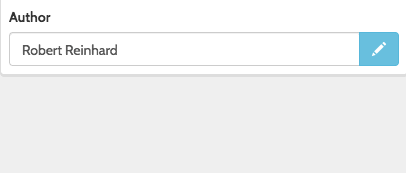
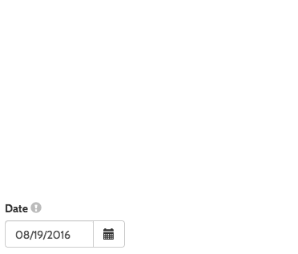
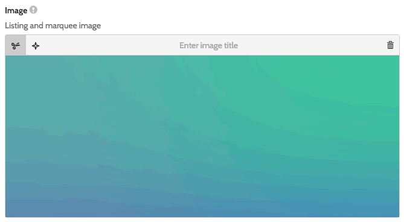
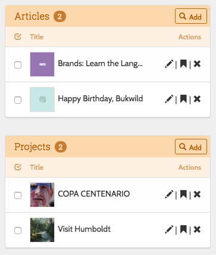
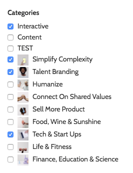
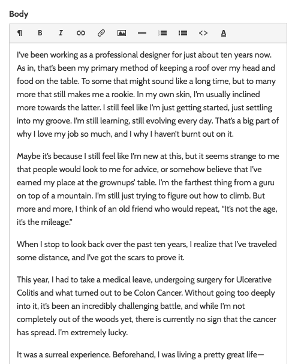

# Custom form fields

The following additional fields come with Decoy.  They are implemented through [Former](https://github.com/formers/former) so you can chain any of the standard Former method calls onto them like "blockhelp", etc.

### Belongs To



- Creates an [autocomplete field](http://cl.ly/image/2e3D3E2o2U2K) that populates a foreign key in a belongs to relationship.
- You must chain either `route($route)` or `parent($model)` to provide the route that can be AJAX GET requested to serve data to the autocomplete.
- If you want to prepopulate, chain, for example, `->value(2)->title("Example")`.

```php?start_inline=1
echo Former::belongsTo('related_product_id', 'Related product')->route('/admin/products');
echo Former::belongsTo('related_product_id', 'Related product')->parent(App\Project::class);
echo Former::belongsTo('author_id', 'Author')->route('/admin/admins')->value(app('decoy.user')->id)->title(app('decoy.user')->getAdminTitleAttribute());
```

### Boolean

- Creates a single checkbox for use with boolean attributes

```php?start_inline=1
echo Former::boolean('featured')->message('Yes, featured')
```

### Checklist

- Wraps Former's `checkbox` field so that it's easier to instantiate using a simple associative array

```php?start_inline=1
echo Former::checklist('category')->from([
	'car' => 'Red Car',
	'bus' => 'Big bus'
]);
```

- Note, the checklist field will POST an array to the server.  You can convert this to a string for storing in the database by [casting](https://laravel.com/docs/5.4/eloquent-mutators#array-and-json-casting) to an array:

```php?start_inline=1
// In your model
protected $casts = [
    'category' => 'array',
];
```

### Date



- Create a [calendar widget](http://cl.ly/image/0m1L2H1i3o12).
- Uses [bootstrap-datepicker](http://www.eyecon.ro/bootstrap-datepicker) for the UI. If you set the value to `'now'`, the current date will populate the field``

```php?start_inline=1
echo Former::date('date', 'Start date')->value('now');
```

### DateTime

- Create a [date-time widget](http://cl.ly/image/3I2G1X1h3s3c), which is like the concatenation of the `date()` and `time()` elements.
- You can set attributes of the date and time inputs, respectively, by chaining `->date($attributes)` and `->time($attributes)` where $attributes is an associative array.
- To access the Former `Field` instances for each field, access the public properties `$date` and `$time`.

```php?start_inline=1
echo Former::datetime('when')->date(array('data-example', 'Hey'))->value('now');
```

### Image



- Creates an image upload with additional UI for reviewing the last upload, cropping it, setting the focal point, entering a title, and deleting it.
- Specify aspect ratio fro cropping tool with `aspect(number)`
- Add focal point selection UI by chaining `addFocalPoint()`

```php?start_inline=1
echo Former::image('image', 'Profile image')->aspect(16/9)->addFocalPoint();
```

### Listing



- Creates an table of model instances like shown in Decoy's index view.  The `name` for the field should be the model class that is being rendered.  Like `Article`.
- `controller()` specifies the controller name if it can't be automatically determined.  You may also pass it an instance of a controller class.
- `items()` stores a collection of model instances to display in the list.  This is optional, `listing()` will try and make a query using the model name to form a query.
- `layout()` allows you to specify the layout.  This is automatically set when passing a `Listing` instance to `$sidebar->add()` from a view.
	- `full` - A full width view like shown on Decoy's index view.
	- `sidebar` - A narrow view like shown in an edit view's related column.
	- `form` - A full width view designed to be show in a horizontal form.
- `take()` - A integer; how many rows to display.
- `scope()` - You may adjust the query that fetches related objects by passing a `callable` to `scope()` which will recieve the query (an `Illuminate\Database\Eloquent\Builder` instance) as it's first argument.

```php?start_inline=1
echo Former::listing('Author')->take(30)->layout('form');
```

### Many To Many Checklist



- Render a [list of checkboxes](http://cl.ly/image/0b2w0J312z2i) to represent a related many-to-many table.  The underlying Former field `type` is a checkbox.
- The relationship name is stored in the field `name`.  This is the name of the relationship method that is defined on the model that is currently being edited in Decoy.
- You may adjust the query that fetches related objects by passing a `callable` to `scope()` which will recieve the query (an `Illuminate\Database\Eloquent\Builder` instance) as it's first argument.
- You can display the results in two columns rather than one by chaining `addGroupClass('two-col')`
- You can chain `decorator($callable)` to pass a function that recieves each checkboxes HTML and model instance and expects you to return transformed HTML for the checkbox.

```php?start_inline=1		
echo Former::manyToManyChecklist('hubs')
	->scope(function($query) use ($product) {
		return $query->where('product_id', '=', $product->id);
	})->decorator(function($html, $model) {
		return $html.Form::hidden('key', 'val');
	});
```

### Note

- A note field has no actual input elements.  It's a control group with just the passed html value where the inputs would be.

```php?start_inline=1
echo Former::note('Creator', $author->name);
```

### Radiolist

- Wraps Former's `radio` field so that it's easier to instantiate using a simple associative array

```php?start_inline=1
echo Former::radiolist('category')->from([
	'car' => 'Red Car',
	'bus' => 'Big bus'
]);
```

### Time

- Create a time [selector widget](http://cl.ly/image/22062i19133Y).
- Uses [bootstrap-timepicker](http://jdewit.github.io/bootstrap-timepicker/) for the UI. If you set the value to `'now'`, the current date will populate the field.

```php?start_inline=1
echo Former::time('time')->value('now');
```

### Upload

- Creates a [file upload field](http://cl.ly/image/1a0q0C0p3V3y) with additional UI for reviewing the last upload and deleting it.
- Decoy uses [Upchuck](https://github.com/BKWLD/upchuck) to facilitate file upload handling.  As a result, file upload fields need to be white listed on the model using the `upload_attributes` property.  See [the usage](https://github.com/BKWLD/upchuck#usage) section of the [Upchuck README](https://github.com/BKWLD/upchuck/blob/master/README.md) for examples.

```php?start_inline=1
echo Former::upload('file');
```

### Video Encoder


- Creates a [video upload field](http://yo.bkwld.com/image/1R3V1T2o1R1P) with additional UI for checking the progress of the encoding and then playing back the video.
- Review the feature on Encoding from this doc for more information on the setup of the video encoding feature of Decoy.
- Decoy uses [Upchuck](https://github.com/BKWLD/upchuck) to facilitate file upload handling.  As a result, file upload fields need to be white listed on the model using the `upload_attributes` property.  See [the usage](https://github.com/BKWLD/upchuck#usage) section of the [Upchuck README](https://github.com/BKWLD/upchuck/blob/master/README.md) for examples.

```php?start_inline=1
echo Former::videoEncoder('video');
```

### WYSIWYG



- Create a textarea that will be wrapped in a WYSIWYG editor by Decoy JS.
- See the [WYSIWYG page](wysiwyg) for information on how to configure the editor.

```php?start_inline=1
echo Former::wysiwyg('body');
```
