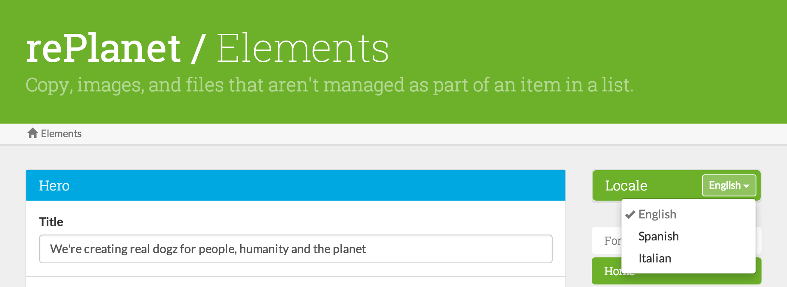
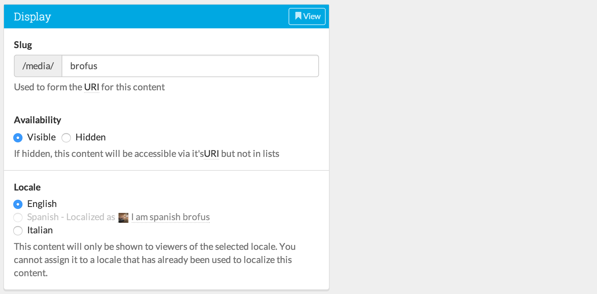
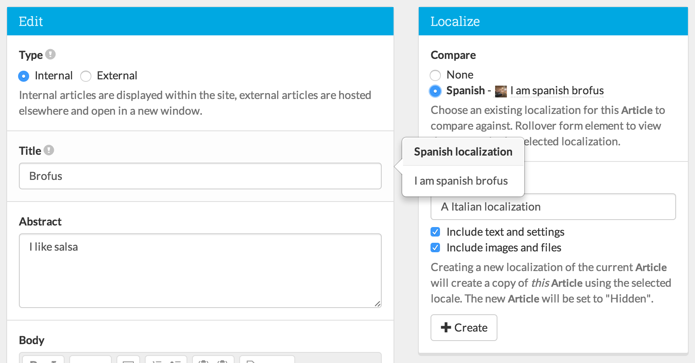

# Localization

Decoy's localization features come in two flavors: (1) localization of Elements and (2) localization of model instances.  In both cases, you begin by editing the Decoy "site.php" config file.

## Elements localization

Add each locale you need to support to the `locales` array, where the keys are a slug for the locale and the value is the readable name for the locale.  The former is stored in the database while the latter is displayed in form elements in Decoy.  As long as there are more than one locale in that array, the Elements UI will show a locale selector:



## Model localization

To localize model records, the database table for your model needs to have the following columns:

- `VARCHAR` `locale`
- `VARCHAR` `locale_group`

Here is an example migration schema:

```php?start_inline=1
Schema::create('articles', function(Blueprint $table) {
	$table->string('locale');
	$table->string('locale_group')->index();
	$table->boolean('public'); // Not required, just an example
	$table->index(['locale', 'public']); // You'll want to use locale in indexes
	$table->index(['public', 'locale']);
});
```

Then, either set the `auto_localize_root_models` config to `true` in the "site.php" file OR (to control localization more granularly) set the `$localizable` static property of a model to `true`:

```php?start_inline=1
class Article extends Base {
	static public $localizable = true;
}
```

If you set the `$localizable` property to false, it will override the global `auto_localize_root_models` config for the model.  When a model has been set to be localizeable, the following two UI elements are automatically added to edit forms.  In the left column, you can change the locale of the model being edited:



In the right column, you can duplicate the current model into a different locale, where you can begin to customize the fields for *that* locale:



The "Compare" radio buttons enable tooltips for each form group that show the value of that group in the selected locale.

## Frontend implementation

Decoy provides some helpers for selecting a locale on the frontend of the site.  It's assumed that there will be some way that a user chooses a locale.  This might be from a menu or by accessing the site from a special domain.  It is up to the developer to implement this uniquely for the site.  To tell Decoy what was selected, call `Decoy::locale($locale)` where `$locale` is the slug of the locale (the key from the "site.php" `locales` config array).  Here is an example route that would set the locale based on what was passed in:

```php?start_inline=1
Route::get('locale/{locale}', ['as' => 'change locale', function($locale) {
	Decoy::locale($locale);
	return Redirect::back();
}]);
```

You can get the current locale by calling `Decoy::locale()` with no argument.  The Decoy Base Model provides a scope for restricting queries by the current locale by chaining `->localize()` onto your query.  For instance:

```php?start_inline=1
Article::ordered()->public()->localize()->paginate(10)
```
