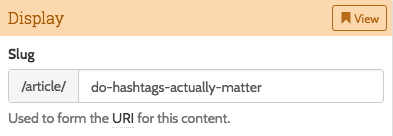
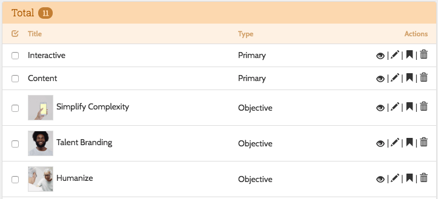
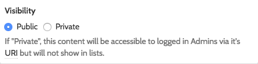
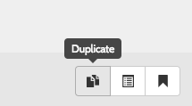
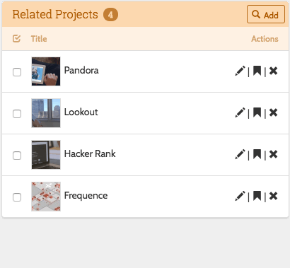

# Models

Decoy uses the same model classes that the public app uses.  Thus, put them as per normal in /app and give them the namespace `App\`.  However, instead of extending `Eloquent`, they should extend `Bkwld\Decoy\Models\Base`.  The base model adds a bunch of functionality to the model that is used by the admin as well as some features that can be used in the public site.

## Conventions

### Deep links



Add a `uri` mutator to your model to tell Decoy how to create deep links to the resource on the public site:

```php?start_inline=1
/**
 * Return the URI to instances of this model
 *
 * @return string A URI that the browser can resolve
 */
public function getUriAttribute() {
	return url('article', $this->slug);
}
```

### Slugs

Slugs are auto created from returned by `Bkwld\Decoy\Model\Base::getAdminTitleAttribute()` as long as your model has a validation rule keyed as `slug`.  Slugs are created using the [cviebrock/eloquent-sluggable](https://github.com/cviebrock/eloquent-sluggable) package.  For instance:

```php?start_inline=1
public static $rules = [
	'slug' => 'alpha_dash|unique:articles',
];
```

The Decoy base model adds the `findBySlugOrFail($slug)` static method to assist in looking up records by slug.  For instance:

```php?start_inline=1
Route::get('news/{slug}', function($slug) {
	return view('news.show', ['article' => Article::findBySlugOrFail($slug)]);
});
```

### Ordering

By defining a `scopeOrdered($query)` method on your class, you can control the order that models appear in the listing views in the admin.  It is useful to use this same scope when fetching models on the public site as well so that the order is consistent in both places.

#### Drag and drop



Decoy also supports drag and drop ordering of rows if you add a `position` integer column to your database migration for a model.  If column with this name is present, Decoy makes the listing rows sortable.  You should add the following functions to your model to use the position column when ordering and to add newly added instances to the end of the line.

```php?start_inline=1
/**
 * Orders instances of this model in the admin as well as default ordering
 * to be used by public site implementation.
 *
 * @param  Illuminate\Database\Query\Builder $query
 * @return void
 */
public function scopeOrdered($query) {
	$query->positioned();
}

/**
 * Put new instances at the end
 *
 * @return void
 */
public function onCreating() {
	if (isset($this->position)) return;
	$this->position = static::max('position') + 1;
}
```

### Visibility



Add a `$table->boolean('public');` column to a migration to add a "public" column that allows the admin to toggle between public and private visibility for a model.  This will automatically add the visibility toggle icon to Decoy listing views.

You can also use the following scopes to filter results to only public items:

- `Model::public()`
- `Model::listing()` // ordered() and public()

Finally, you can call `$model->enforceVisibility()` to throw an access denied error if the user doesn't have permission to view a model.  This is called automatically by `findBySlugOrFail()`.

## Lifecycle hooks

The Decoy base model adds the following no-op methods that correspond to [Laravel Eloquent events](https://laravel.com/docs/eloquent#events) and provide a convenient place to hang business logic:

```php?start_inline=1
public function onSaving() {}
public function onSaved() {}
public function onCreating() {}
public function onCreated() {}
public function onUpdating() {}
public function onUpdated() {}
public function onDeleting() {}
public function onDeleted() {}
```

In addition, the following hooks are defined for Decoy-specific events:

```php?start_inline=1
public function onValidating($validation) {}
public function onValidated($validation) {}
public function onAttaching($parent) {}
public function onAttached($parent) {}
public function onRemoving($parent) {}
public function onRemoved($parent) {}
```

## Duplication



Decoy implements [Cloner](https://github.com/BKWLD/cloner) to allow admins to duplicate models.  A single model and it's files should work right out of the box.  To support cloning relationships, specify a `$cloneable_relations` array on the model.  Read the [Cloner docs](https://github.com/BKWLD/cloner#usage) for more info and some other options.


## Relationships

### Many to Many relationships

Decoy expects you to name your relationships after the model/table. So a post with many images should have an "images" relationship defined.  Then, add the following code to your edit view to add a listing interface to the sidebar of the page.

```php?start_inline=1
$sidebar->add(Former::listing('App\Image'));
```

The listing interface will allow you to attach Images to your Post and will look similar to this:




Since we typically add timestamps to pivot tables, you'll want to call `withTimestamps` on relationships.  And, if the pivot rows should be sortable, you'l need to use `withPivot('position')` so that the position value gets rendered to the listing table.  Additionally, the easiest way to have Decoy sort by position in the admin is to add that `orderBy` clause to the relationships as well.  So your full relationship function may look like (don't forget that both models in the relationship need to be defined):

```php?start_inline=1
public function images() {
	return $this->belongsToMany('Image')
		->withTimestamps()
		->withPivot('position')
		->orderBy('article_image.position');
}
```

Here is an example of how you can set the `position` column to the `MAX` value, putting the attached record at the end, by using an event callback on the Model that gets attached:

```php?start_inline=1
/**
 * When attached as a related set the position on the pivot column to the end
 *
 * @param  Illuminate\Database\Eloquent\Model
 * @return void
 */
public function onAttached($parent) {
	if (get_class($parent) == 'Article') {
		$parent->images()->updateExistingPivot($this->id, [
			'position' => $parent->images()->max('article_image.position') + 1,
		]);
	}
}
```

### Many to Many to Self

I am using this term to describe a model that relates back to it self; like a project that has related projects.  You should define two relationship methods as follows:

```php?start_inline=1
public function projects() {
	return $this->belongsToMany('App\Project', 'project_projects', 'project_id', 'related_project_id');
}
public function projectsAsChild() {
	return $this->belongsToMany('App\Project', 'project_projects', 'related_project_id', 'project_id');
}
```

The "AsChild()" naming convention is significant.  The Decoy Base Controller checks for this when generating it's UI.

### Polymorphic relationships

You must use the convention of suffixing polymorphic stuff with "able".  For instance, in a one to many, the child should have a "...able()" relationship function.  For example, in a `Slide` controller, it should be called `slideable()`.

### Polymorphic Many to Many to Self

Example:

```php?start_inline=1
public function services() {
	return $this->morphedByMany('App\Service', 'serviceable', null, 'serviceable_id', 'service_id')
    ->withTimestamps();
}
public function servicesAsChild() {
  return $this->morphedByMany('App\Service', 'serviceable')
    ->withTimestamps();
}
```

## Serialization

Models are configured to return instances of `Bkwld\Decoy\Collections\Base` as their collection.  The `Base` collection adds an API that allows you to register transformations that get applied before serialization.  For instance:

```php?start_inline=1
Route::get('articles.json', function() {
  return App\Article::listing()->get()
    ->serializeTransform(function(App\Article $article) {
      return $article->title = Str::limit($article->title, 40);
    });
});
```

It also adds a convenience method for registering transformations to generate crops of [`Images`](https://github.com/BKWLD/decoy/wiki/6.-Feature:-Images):

```php?start_inline=1
Route::get('articles.json', function() {
  return App\Article::listing()->get()
    ->withDefaultImage(200)
    ->withImage('marquee', 200, 100, ['resize'])
    ->withRenamedImage('headshot', 'person', 300);
});
```

Or, if using paginate:

```php?start_inline=1
Route::get('articles.json', function() {
  $result = App\Article::listing()->paginate(6);
  $result->getCollection()->withDefaultImage(200);
  return $result;
});
```

The rendered JSON will be like:

```json
[
   {
      "title":"An article",
      "date":"2016-01-14 00:00:00",
      "imgs":{
         "default":{
            "title":"Stunning photo",
            "low":"\/uploads\/07\/12\/Photo_on_6-13-15_at_6.08_AM-450x250.jpg?token=43280908b4ce71bfdb11ce19df95597b",
            "medium":"\/uploads\/07\/12\/Photo_on_6-13-15_at_6.08_AM-900x500.jpg?token=25981b063fa0643c876804557bba82f6",
            "high":"\/uploads\/07\/12\/Photo_on_6-13-15_at_6.08_AM-1800x1000.jpg?token=5351888634d8a5f5090ecc3a720707dc",
            "background_position":"20% 30%"
         },
         "thumb":{
            "title":"Stunning photo",
            "low":"\/uploads\/07\/12\/Photo_on_6-13-15_at_6.08_AM-100x100.jpg?token=0871b9a954c8458333929efd741c5bc8",
            "medium":"\/uploads\/07\/12\/Photo_on_6-13-15_at_6.08_AM-200x200.jpg?token=a7e997b0fd010f104172bfde0890b489",
            "high":"\/uploads\/07\/12\/Photo_on_6-13-15_at_6.08_AM-400x400.jpg?token=3883163c71c23ff6843aa8de31f65abd",
            "background_position":"20% 30%"
         }
      },
      "uri":"\/articles\/did-you-get-me"
   }
]
```
