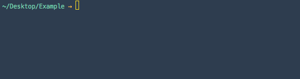

# Quick start

This guide walks you through using Decoy to create a simple news article listing for your site.  It is assumed that you've already [installed Decoy](index).

## Step 1 - Database migration

Create a normal database migration to store your articles:

```
php artisan make:migration --create=articles create_articles
```

Create columns for title, slug, body, date, and public (whether it should be published publicly):

```php?start_inline=1
Schema::create('articles', function(Blueprint $table) {
  $table->increments('id');
  $table->string('title');
  $table->string('slug')->unique();
  $table->text('body');
  $table->date('date');
  $table->boolean('public');
  $table->timestamps();
  $table->index(['public', 'date']);
});
```

Run the migration: `php artisan migrate`.

## Step 2 - Generate model, controller, and view



Decoy provides [a generator](generator) that creates the controller, model, and view for the data you are managing.  Run `php artisan decoy:generate Article`. This creates the following files:

- `app/Article` - The model (shared by admin and public sites)
- `app/Http/Controllers/Admin/Articles.php` - The controller
- `resources/views/admin/articles/edit.haml.php` - The view

## Step 3 - Configure the model

You'll notice that the generated model has a bunch of commented out code by default.  That code represents common functionality and is there to help you get started.  Edit it until it looks like this:

```php
<?php namespace App;
use Bkwld\Decoy\Models\Base;
use Bkwld\Decoy\Models\Traits\HasImages;

class Article extends Base {
  use HasImages;

  /**
   * Add date fields
   *
   * @var array
   */
  protected $dates = ['date'];

  /**
   * Validation rules
   *
   * @var array
   */
  public static $rules = [
    'title' => 'required',
    'slug' => 'alpha_dash|unique:articles',
    'body' => 'required',
    'date' => 'required',
    'images.default' => 'required|mimes:jpeg',
    'images.marquee' => 'required',
  ];

  /**
   * Orders instances of this model in the admin as well as default ordering
   * to be used by public site implementation.
   *
   * @param  Illuminate\Database\Query\Builder $query
   * @return void
   */
  public function scopeOrdered($query) {
    $query->orderBy('date', 'desc');
  }

  /**
   * Return the URI to instances of this model
   *
   * @return string A URI that the browser can resolve
   */
  public function getUriAttribute() {
    return url('article', $this->slug);
  }

}
```

Let me expand on the key components of this file:

- The model subclasses the Decoy base model (which in turn subclasses the Eloquent model).

- The `HasImages` trait adds support for this model having [images](images).

- We're using [standard Laravel model conventions](https://laravel.com/docs/eloquent-mutators#date-mutators) to make our `date` column get automatically mutated into a [Carbon](https://github.com/briannesbitt/Carbon) instance.

- [Laravel-style](https://laravel.com/docs/5.3/validation#available-validation-rules) [Validation rules](validation) get stored in the model in the static `$rules` property.

- The `ordered` scope is [a convention](models#ordering) used by Decoy to specify the order that items should appear in the index, listing view for the model.

- Finally the `uri` mutator is another [Decoy convention](models#deep-link) for specifying the deep link for this model on the public site.

For more information, see [Models](models).

## Step 4 - Configure the edit view

The create and edit form are both created by a simple Laravel view.  The view file created by the generator is written in [HAML](https://github.com/arnaud-lb/MtHaml) but can be changed to php, blade, or anything else by just changing the file suffix.  Change the edit view to this to create the fields required for our Article model.

```haml
!= View::make('decoy::shared.form._header', $__data)->render()

%fieldset
  .legend= empty($item) ? 'New' : 'Edit'
  != Former::text('title')
  != Former::image()
  != Former::image('marquee')
  != Former::wysiwyg('body')

%fieldset
  != View::make('decoy::shared.form._display_module', $__data)->render()
  != Former::date('date')->value('now')

!= View::make('decoy::shared.form._footer', $__data)->render()
```

For more information, see [Views](views) and [Custom form fields](custom-fields).

## Step 5 - Configure the controller

Like the model, the generated controller contains a number of commented out line and also subclasses a Decoy base class.  The generated file is rather empty, it contains some protected properties that are used to configure aspects of the user interface for this specific resource.  If you need to do something deeply custom, a developer can also override inherited methods for each CRUD.

Change your Article controller to:

```php
<?php namespace App\Http\Controllers\Admin;
use Bkwld\Decoy\Controllers\Base;

class Articles extends Base {
  protected $title = 'News';
  protected $description = 'Articles that appear in the News section.';
  protected $columns = [
    'Title' => 'getAdminTitleHtmlAttribute',
    'Date' => 'date',
  ];
  protected $search = [
    'title',
    'date' => 'date',
  ];
}
```

This configuration renames how the resource is titles from its default "Articles" to "News", defines a description that shows up in the header, configures what columns show up in the listing table, and configures how the fields available in the search.

For more information, see [Controllers](controllers).

## Step 6 - Add the public route

In order for the `getUriAttribute()` accessor to work, you must create the `article` route in your Laravel routes file:

```php?start_inline=1
Route::get('news/{slug}', ['as' => 'article', function($slug) {
  return view('news.show', ['article' => Article::findBySlugOrFail($slug) ]);
}]);
```

While doing that, you could stub out the listing view as well:

```php?start_inline=1
Route::get('news', ['as' => 'news', function() {
  return view('news.index', ['articles' => Article::listing()->paginate(12) ]);
}]);
```

## Step 7 - Edit the Decoy navigation

Now, update the admin navigation to include "News", the label for managing Article models.  The contents of the navigation are stored in the `config/decoy/site.php` file.  There is no need to setup any special routing definitions, this happens [automatically](routing).

```php
<?php return [
  'name' => 'Your site',
  'nav' => [
    'News,align-left' => '/admin/articles',

    // Decoy defaults
    'Elements,leaf' => '/admin/elements',
    'Redirects,new-window' => '/admin/redirect-rules',
  ],
];
```

The `align-left` defines an icon to use in the navigation sidebar.  These can be  any of the [Bootstrap Glyphicon names](http://getbootstrap.com/components/#glyphicons-glyphs).

## Step 8 - Create an admin account

Create yourself an admin account by running `php artisan decoy:admin` in the [console](console) and answering its prompts.


## Step 9 - Login and start creating content

Finally, you can go to /admin in your browser (for whatever your development domain is) and login using the credentials you just used to create an initial account.  You should be seeing the following:


